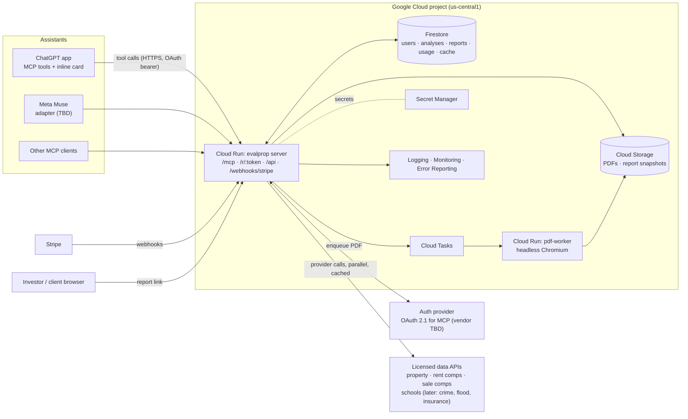
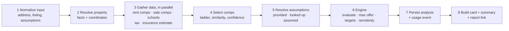

# evalprop — Architecture

A paid **connector** that lets an investor share a US property (a Redfin/Zillow link, an address, or pasted listing text) inside an AI assistant (ChatGPT first; Meta Muse and any MCP client next) and get back, in seconds, a trustworthy **rental-investment verdict**: cash flow, returns, a **max allowable offer**, break-even and hold-period analysis, rent and sale comparables, schools, and a client-ready **report** (web page and PDF).

The assistant explains and converses. **All numbers come from our deterministic engine**, never from the model. Every figure says where it came from: provided by the user, looked up (source and date), or an assumed default.

Product definition (personas, principles, full story catalogue, comp rules, open decisions): [docs/PRODUCT.md](docs/PRODUCT.md). Build backlog: [docs/STORIES.md](docs/STORIES.md).

---

## 1. Goals and non-goals

**Goals (launch / paid beta)**

- One tool call turns "an address plus whatever the assistant read from the listing" into a saved **analysis** with an ID: enrichment, calculations, verdict, max offer, hold analysis, comps, schools, and a report link.
- **Follow-ups are cheap and exact:** "offer $215k at 6.5%" re-runs the engine on the saved analysis and returns a before/after comparison.
- **Comps behave like an investor would pick them:** nearest first (0.5 → 1 → 2 miles), same unit type and size first, adjacent sizes only as a labelled fallback (§9).
- A **hosted report** (shareable link, PDF) good enough to forward to a partner, lender, or client.
- **Never fail silently:** slow or missing data degrades the report visibly (§7.3); it never blocks the verdict and never invents a "looked up" number.
- A **paid product:** OAuth sign-in from inside the assistant, a free tier, one paid plan, usage metering, per-report cost visibility (§6, §12).
- **Fast:** verdict in chat in a few seconds (budget in §7.4, to be measured, not promised).

**Non-goals (launch)**

- No scraping of Redfin, Zillow, or any listing site (terms of service). A listing link is only a way to get the **address**; property facts come from licensed providers or from what the user/assistant supplies (§10).
- No short-term-rental, mid-term, or value-add modelling at launch (product epics E9; later).
- No tax advice, no investment advice. Reports carry disclaimers (§12).
- No separate web app at launch beyond report pages (account page, saved deals, branding editor come in 1.1).
- No client-side Firebase SDK. Only our server touches the database (§6).
- The model never does arithmetic and never writes numbers into reports.

---

## 2. System overview



**One service, thin adapters.** The `server` app is a single Cloud Run service exposing a standard MCP endpoint (Streamable HTTP) plus report pages and webhooks. Platform differences (ChatGPT's inline widget, Muse's requirements) live in thin adapter layers, never in the engine or pipeline.

**Why a backend at all?**
1. API keys for data providers and Stripe never leave the server.
2. Analyses are **saved with an ID** so what-ifs, comparisons, reports, saved deals, and usage billing all refer to one record.
3. Provider results are cached by address, which protects margin (§10.4).
4. Question wording, thresholds, and defaults can change without touching any assistant integration.

**Who writes what:** the server is the only reader/writer of Firestore and Storage (Admin SDK). Firestore rules deny all client access. There is no client SDK.

---

## 3. Tech stack

| Layer | Choice | Notes |
|---|---|---|
| Language | **TypeScript end to end** | Strict mode. Node ≥ 22 runs `.ts` natively in tests (the engine already does) |
| Monorepo | pnpm workspaces | `packages/*`, `apps/*` (§4) |
| Server | **Hono** (or Express) on Node, in a container on **Cloud Run** | One service: `/mcp`, `/r/:token`, `/api/*`, `/webhooks/stripe`, `/health`. Min 1 instance for latency |
| MCP | Official TypeScript MCP SDK, Streamable HTTP transport | Tool registry in one file (§5.1) |
| Validation | **zod** in `packages/shared` | One contract for tool inputs/outputs, Firestore documents, provider payloads |
| Calculations | `packages/engine` (pure TS, zero dependencies) | Already written and tested (S01 adopts it). Versioned (§8) |
| Database | **Firestore** (native mode, `us-central1`) | Server-only access. Repository interfaces hide it, so Cloud SQL stays possible later |
| Files | **Cloud Storage** | PDFs and report snapshots; signed URLs only, never public |
| Async | **Cloud Tasks** → pdf-worker (Cloud Run) | PDF needs headless Chromium, kept out of the main service |
| Auth | **Managed OAuth provider** behind an `AuthProvider` interface | MCP clients need OAuth 2.1 with discovery and dynamic client registration; Firebase Auth does not provide that. Vendor chosen in S11 (Stytch, WorkOS, Auth0 advertise MCP support; verify) |
| Payments | **Stripe** (Checkout + webhooks, test mode in dev) | Plans and limits in one config file (§6.3) |
| Data | Provider adapters behind one gateway (§10) | First provider chosen in S04 |
| Reports | Server-rendered HTML + inline SVG charts, no client framework | PDF rendered from the same HTML |
| Inline card | Small self-contained component bundle for ChatGPT's widget surface | `apps/widget` (S09) |
| Secrets | Secret Manager (prod), `.env` git-ignored (local) | Never in code or logs |
| Observability | Cloud Logging, Error Reporting, Monitoring | Structured logs with `analysisId`, provider cost, latency per stage |
| CI/CD | GitHub Actions → Artifact Registry → Cloud Run | Separate `dev` and `prod` projects |
| Local dev | Firestore + Storage emulators, fake provider, fake auth | The whole product runs offline with recorded fixtures |
| Region | `us-central1` | Central for a US-wide audience. Set once |

**Why Cloud Run and Firestore:** Cloud Run scales to zero but a minimum instance removes cold starts from the chat path; it needs no operations. Firestore costs almost nothing at launch and needs no maintenance. The data model (§6) is small and key-addressed. Heavy analytical queries can export to BigQuery later.

---

## 4. Repository layout

```
evalprop/
├─ ARCHITECTURE.md  AGENTS.md  CLAUDE.md  README.md
├─ docs/
│  ├─ PRODUCT.md         product definition: personas, principles, story catalogue, comp rules
│  ├─ STORIES.md         build backlog (this is what agents pick up)
│  └─ SETUP.md           accounts and keys the product owner provides
├─ packages/
│  ├─ shared/            zod schemas + types: the contracts (Property, Assumptions, Analysis, Comp, tool I/O, plans)
│  ├─ engine/            pure calculation engine: finance, hold analysis, sensitivity, targets, verdict
│  ├─ comps/             pure comp-selection logic: search ladder, similarity, confidence (§9)
│  ├─ data/              provider interface, gateway, cache, normalizers, adapters, recorded fixtures (§10)
│  └─ report/            report model → HTML (+ SVG charts) (§11)
├─ apps/
│  ├─ server/            Cloud Run service: MCP, pipeline, report routes, billing, auth glue
│  ├─ pdf-worker/        Cloud Run service: HTML → PDF
│  └─ widget/            inline deal card (ChatGPT) bundle
├─ evals/                golden math cases, comp-selection fixtures, tool-invocation prompts
├─ tests/rules/          Firestore deny-all rules test
├─ firestore.rules  firestore.indexes.json  firebase.json   (emulators + rules only)
└─ .github/workflows/ci.yml
```

Today the repo has the calculation engine and its tests at `src/calc/` and `test/calc.test.ts`. S00 creates the skeleton and S01 moves them into `packages/engine`.

---

## 5. Connector design

### 5.1 Tool surface (four tools)

Few tools, strong descriptions: fewer choices make the assistant more likely to call the right one, and one call doing the whole job keeps latency low. Tool schemas live in `packages/shared/src/tools.ts`; handlers in `apps/server/src/mcp/`.

| Tool | Purpose | Writes |
|---|---|---|
| `analyze_property` | Address plus whatever the assistant extracted from the listing → enrichment, calculations, saved analysis with an ID, report link, all in one call | analysis, usage event |
| `what_if` | `analysisId` plus overrides → new analysis and a before/after comparison | analysis, usage event |
| `compare_properties` | 2–5 `analysisId`s → side-by-side metrics and a ranking | none |
| `create_report` | `analysisId` plus recipient name, note, section toggles, branding → hosted report, PDF, share link | report |

**`analyze_property` input (sketch; the zod schema in `packages/shared` is authoritative)**

```ts
{
  address: string,                 // street address; required unless listing.url resolves to one
  listing?: {                      // anything the assistant already read; every field optional
    url?, price?, beds?, baths?, sqft?, yearBuilt?, propertyType?,
    taxesAnnual?, hoaMonthly?, daysOnMarket?, description?, monthlyRentActual?
  },
  assumptions?: {                  // the engine's PropertyInput overrides + offer price
    offerPrice?, monthlyRent?, downPaymentPct?, interestRatePct?, loanTermYears?, closingCostPct?,
    rehabCost?, propertyTaxAnnual?, insuranceAnnual?, hoaMonthly?, vacancyPct?, maintenancePct?,
    capexPct?, managementPct?, rentGrowthPct?, expenseGrowthPct?, appreciationPct?, sellingCostPct?, holdYears?
  },
  targetCashOnCashPct?: number,    // default 8
  advisoryFlags?: { title, detail, tone }[]   // signals the assistant spotted ("tenant-occupied", "new roof"); shown, never calculated
}
```

**Output shape.** Every tool returns:
- `structuredContent`: the compact **card model** (verdict, four headline metrics, max offer, break-even, 10-year IRR, comps summary, confidence, report URL, data notes). This drives the inline card and is what the assistant should quote.
- `content[0].text`: a short plain-language summary the assistant can relay (verdict, the lever that matters, any data caveat).
- `_meta`: the full `Evaluation` and provenance for widgets and follow-ups (not shown to the user directly).
- Errors use MCP tool errors with a stable `code` (`NEEDS_ADDRESS`, `AMBIGUOUS_ADDRESS` with candidates, `QUOTA_EXCEEDED` with upgrade link, `INVALID_ASSUMPTION` naming the field).

**Rules for tool behaviour**
1. The handler validates input with zod, then calls `runAnalysis` (§7). Handlers contain no business logic.
2. `analyze_property` is idempotent per `(uid, normalized input hash)` within 10 minutes: a retry returns the same analysis and does **not** bill twice.
3. Overrides are tracked as `provided`; nothing silently resets them (product E2.3).
4. If the address is ambiguous, return candidates and ask; never guess.

### 5.2 Invocation quality

The assistant decides when to call a tool from its **name and description**. Descriptions are product code:
- `analyze_property` says exactly when to use it ("the user shares a listing link or address and asks about investment value, rental yield, cash flow, or whether to buy/offer") and when not to ("general real-estate questions, mortgages, renting as a tenant").
- Examples in the description show what a good call looks like (address plus extracted listing fields).
- `evals/invocation/` holds a prompt set labelled **should call / should not call / which tool**, run against the real assistants during hardening (S13). Description changes re-run it.

### 5.3 ChatGPT app and inline card

- The server is a standard MCP server; the ChatGPT app is the same endpoint plus an inline **widget** that renders the card model (`apps/widget`: verdict pill, four metric tiles, max offer, break-even, IRR, buttons for "Open full report" and "Change assumptions").
- The widget is a pure function of `structuredContent`; it holds no secrets and calls no APIs.
- Exact registration mechanics (widget resource URI, template metadata, directory submission rules) follow OpenAI's current developer docs. **S09 and S16 re-verify against those docs before building; do not rely on memory.**

### 5.4 Meta Muse adapter

Not designed yet: Muse's developer documentation has not been reviewed. If Muse speaks MCP, the same endpoint serves it and only a card/format adapter is needed. If not, the adapter is a thin HTTP wrapper over `runAnalysis`. **Blocked on product owner providing the Muse docs (open question 5).** Nothing in the engine, pipeline, or data layers depends on the answer.

### 5.5 Authentication (OAuth for the connector)

- MCP clients sign users in through OAuth 2.1. The server publishes protected-resource metadata and verifies bearer tokens on every `/mcp` call through an **`AuthProvider` interface** (`verifyAccessToken(token) → { uid, email, planHint? }`).
- Production implementation wraps a managed auth vendor that supports MCP-style OAuth (discovery, dynamic client registration, PKCE). Local and tests use `FakeAuthProvider`.
- The user account (Firestore `users/{uid}`) is created on first successful call. No passwords are stored by us.
- S11 begins with a short **spike**: confirm the chosen vendor passes a real MCP client's OAuth flow end to end, then implement. The vendor choice is a product-owner decision (open question 1).

### 5.6 Plans, quotas, and metering

- Plans live in `packages/shared/src/plans.ts` (`free`, `pro`; `agent` in 1.1): monthly analysis allowance, what-if allowance, report watermark, branding allowed.
- Each billable action writes a **usage event** (§6) with provider call count and estimated cost. A counter on `users/{uid}` (per month key) is incremented in a Firestore transaction **before** the pipeline runs and rolled back on failure.
- `QUOTA_EXCEEDED` returns a plain message and an upgrade link. The free tier shows the verdict and numbers; the report is watermarked or reduced (exact split in open question 3).
- Stripe Checkout creates the subscription; webhooks (`customer.subscription.*`, signature-verified) set `users/{uid}.plan`. Webhook handlers are idempotent by event ID.

### 5.7 Report pages and share links

- `GET /r/:token` serves the hosted report. The token is an unguessable 128-bit random value; only its **hash** is stored. Reports are unlisted, revocable (`revokedAt`), and may expire.
- Pages carry `noindex`. Responses are cacheable per report version.
- A report is a **snapshot** of an analysis plus presentation options. Refreshing creates a new version (product E6.8).

---

## 6. API and data model

### 6.1 HTTP surface (Cloud Run)

| Route | Purpose |
|---|---|
| `POST /mcp` (Streamable HTTP) | MCP endpoint: `analyze_property`, `what_if`, `compare_properties`, `create_report` |
| `GET /.well-known/oauth-protected-resource` | OAuth discovery metadata |
| `GET /r/:token` | Hosted report (HTML) |
| `GET /r/:token/pdf` | Redirect to a short-lived signed URL for the PDF |
| `POST /webhooks/stripe` | Stripe events (signature-verified, idempotent) |
| `POST /internal/pdf` | Called by Cloud Tasks to render a PDF (authenticated service-to-service) |
| `GET /health` | `{ ok, engineVersion, region }` |

### 6.2 Firestore data model (server-only)

| Collection / doc | Fields | Notes |
|---|---|---|
| `users/{uid}` | `email`, `plan`, `stripeCustomerId`, `usage: { "2026-10": { analyses, whatIfs } }`, `branding` (1.1), `createdAt` | Counter changes only inside transactions |
| `analyses/{analysisId}` | `ownerUid`, `createdAt`, `engineVersion`, `pipelineVersion`, `address` (normalized), `propertyFacts`, `inputs` (resolved assumptions with `source`), `evaluation`, `market` (comps, schools, provenance, confidence), `advisoryFlags`, `baseAnalysisId?`, `dataNotes[]`, `inputHash` | Immutable after creation. A what-if creates a new analysis |
| `reports/{reportId}` | `analysisId`, `ownerUid`, `tokenHash`, `options` (recipient, note, sections, branding snapshot), `version`, `pdfPath?`, `createdAt`, `revokedAt?`, `expiresAt?` | Token itself is never stored |
| `users/{uid}/usage/{eventId}` | `type`, `analysisId`, `providerCalls[{ provider, endpoint, cached, costCents, ms }]`, `createdAt` | Ledger for cost per report and billing audits |
| `cache/{key}` | `provider`, `endpoint`, `payload` (normalized), `fetchedAt`, `expiresAt` | Key = hash of provider + endpoint + normalized request |
| `stripeEvents/{eventId}` | `processedAt` | Idempotency |

IDs are random and unguessable. Composite indexes live in `firestore.indexes.json`.

### 6.3 Security rules (summary)

- **Deny everything** to clients (`allow read, write: if false`). All access is through the Admin SDK on the server. A rules test proves nothing is readable or writable by an unauthenticated or authenticated client.
- Every server read of a user's data checks `ownerUid === uid` from the verified token. A repository-level helper enforces it, with tests.
- Storage: no public objects. PDFs are served only via short-lived signed URLs issued after the report token is verified.

---

## 7. Analysis pipeline (the core)

`runAnalysis(request, ctx)` in `apps/server/src/pipeline/` is the single orchestration used by `analyze_property` and (with a base analysis) `what_if`.



### 7.1 Stages

1. **Normalize:** zod-validate, standardize the address string, compute the input hash.
2. **Resolve property:** geocode and fetch facts through the gateway. User/assistant-supplied `listing` fields **override** looked-up facts (and are marked `provided`). Ambiguous addresses return candidates.
3. **Gather (parallel, per-call timeout):** rent comps and sale comps (radius search, §9), assigned schools, tax and insurance estimates. Each call goes through the cache (§10.4).
4. **Select comps** with `packages/comps` (§9). Output: low / median / high rent, the comps used with reasons, ladder step reached, confidence.
5. **Resolve assumptions:** precedence is **user-provided > listing-provided > looked-up > assumed default**. Every field records its source. Rent estimate = comps median unless provided. Property tax uses the **purchase-price basis in reassessing states** (state table in `packages/engine`, §8).
6. **Engine:** `evaluate`, `maxPriceForCashOnCash`, `breakEvenRent`, sensitivity grids, stress case (1.1).
7. **Persist:** analysis document plus usage event (transaction with the quota counter).
8. **Respond:** card model, text summary, report URL (the report is rendered on demand from the saved analysis, so this step is cheap).

### 7.2 What-if

`what_if(analysisId, overrides)` loads the base analysis (owner-checked), **reuses its market data** (no new provider calls unless the address or purchase price basis changes tax), re-runs stages 5–8, and returns the before/after rows (cash flow, cash-on-cash, DSCR, break-even, IRR). It counts against the what-if allowance, which is larger than the analysis allowance.

### 7.3 Degradation rules (never fail silently)

| Situation | Behaviour |
|---|---|
| A provider times out or errors | Continue; the affected section is marked "data unavailable" in `dataNotes`; fields fall back to assumed defaults, labelled `assumed` |
| No rent comps pass the ladder | Rent confidence = low; fall back to the provider's automated estimate if any, else require the user's rent. The verdict is withheld if there is no rent at all (the card says why and asks) |
| Property facts missing (beds, sqft) | Use what the user supplied; comp matching relaxes accordingly and says so |
| Schools unavailable | Section omitted with a note; verdict unaffected |
| Everything unavailable | Still return an engine result from user-supplied numbers plus labelled defaults |
| Quota exceeded | `QUOTA_EXCEEDED` before any provider call (no cost incurred) |

### 7.4 Latency budget (targets to measure in S14; not promises)

| Stage | Budget |
|---|---|
| Auth + validation | ≤ 100 ms |
| Provider calls (parallel, cached hit ≈ 0) | ≤ 3.5 s per call, 5 s overall deadline |
| Comp selection + engine + sensitivity | ≤ 150 ms |
| Persist + respond | ≤ 300 ms |
| **Total p95 (cold cache)** | **≤ 8 s** |
| **Total p95 (warm cache)** | **≤ 1.5 s** |

Min instances = 1, CPU boost on, provider calls in parallel, aggressive caching.

---

## 8. Calculation engine (`packages/engine`)

Pure TypeScript, no I/O, no dependencies, **already implemented and tested** (20 tests at the time of writing). Public API:

- `evaluate(input: PropertyInput) → Evaluation`: year-one metrics (NOI, cap rate, cash-on-cash, DSCR, GRM, 1% rule, 50% rule, break-even occupancy), a month-by-month hold simulation rolled into year rows (cash payback month, total break-even month including sale proceeds, equity, profit if sold, IRR and equity multiple at 5/10/20/hold years), a verdict, the checks behind it, and the full assumption list with `provided`/`assumed` sources.
- `maxPriceForCashOnCash(input, targetPct)`: bisection on price.
- `breakEvenRent(input)`: rent for $0 cash flow (linear solve).
- `sensitivity(base, xField, xValues, yField, yValues, metric)`: two-way grids.
- `InputError` for invalid ranges.

**Rules**
1. **Deterministic and versioned.** `ENGINE_VERSION` (semver) is exported and stored on every analysis. Any change to formulas, defaults, or thresholds bumps it and updates golden tests.
2. **Defaults are conservative and always reported as assumed** (25% down, 6.75% rate, 8% vacancy, 8% maintenance, 5% CapEx, 8% management, 3% growth/appreciation, 6% selling costs; tax 1.1% and insurance 0.5% of price when unknown).
3. **Verdict thresholds are visible:** cash flow > 0, cash-on-cash ≥ 8%, cap rate ≥ 6%, DSCR ≥ 1.25. The user's own criteria (product E3.3) replace them in 1.1.
4. **Hand-verified tests.** Golden cases are computed independently (by hand or a separate script); the amortization schedule is cross-checked against iteration. Zero-rent and invalid inputs never produce NaN.

**Planned additions (tracked as stories):** state property-tax reassessment table (S01), stress case and financing types (1.1), after-tax view (later).

---

## 9. Comparable selection (`packages/comps`)

Pure logic over normalized candidate lists. It never calls a provider; the gateway supplies candidates already filtered by location. Specification (product §4):

**Subject profile:** property type, beds, baths, sqft, year built, and, for a unit in a larger building, the building's unit mix (inferred from same-building listings and records).

**Search ladder (similarity before distance):**

| Step | Radius | Match | Stop when |
|---|---|---|---|
| 1 | Same building | Same unit type | n/a; always included first if present |
| 2 | 0.5 mile | **Strict:** same type, same beds, baths ±1, sqft ±15% | ≥ 5 comps (minimum 3) |
| 3 | 1 mile | Strict | enough |
| 4 | 2 miles (configurable by density) | Strict | enough |
| 5 | 0.5 → 2 miles | **Relaxed:** sqft ±30%, or adjacent bed count, **size-adjusted by rent per sqft**, tagged "different size" | enough |
| 6 | n/a | Insufficient comps | falls back per §7.3 |

**Quality rules:** prefer recent (≈ 90–180 days) and weight newer comps higher; trim outliers; report 25th / median / 75th percentile; label **asking vs leased**; one comp per unit/listing (dedupe); never pad a result with farther comps when closer ones suffice.

**Confidence:** *High* = 5+ strict comps within 1 mile; *Medium* = 3–4 strict, or relaxed within 1 mile; *Low* = anything else. Each comp carries a `matchReason` (e.g. "Same size, 0.3 mi") so the report can explain every row.

**Output:** `{ estimate: { low, median, high }, comps: [...], stepReached, radiusUsedMiles, confidence, notes[] }`. The same function ranks **sale comps** (price per sqft, recency) for the "is the list price in line?" check.

Unit-test fixtures cover: a uniform 1-bed building, a sparse suburban area needing the 2-mile step, relaxed fallback with size adjustment, insufficient comps, outliers, duplicates, and stale listings.

---

## 10. Data layer (`packages/data`)

### 10.1 Provider interface

All external data goes through one interface per capability, returning **normalized types from `packages/shared`**. Adapters are swappable and each returns provenance.

```ts
interface PropertyProvider  { resolve(address): Promise<Resolved<PropertyFacts>>; }
interface RentProvider      { rentCandidates(subject, radiusMiles): Promise<Resolved<RentListing[]>>; rentEstimate(subject): Promise<Resolved<RentEstimate>>; }
interface SalesProvider     { saleCandidates(subject, radiusMiles): Promise<Resolved<SaleListing[]>>; }
interface SchoolsProvider   { assignedSchools(location): Promise<Resolved<School[]>>; nearbySchools(location, radiusMiles): Promise<Resolved<School[]>>; }
// 1.1: CrimeProvider, GrowthProvider, InsuranceProvider, FloodProvider

type Resolved<T> = { data: T; provenance: { provider: string; fetchedAt: string; cached: boolean; confidence?: 'high'|'medium'|'low'; note?: string } };
```

### 10.2 Provider selection (S04)

The first licensed provider must support: address → facts, radius search for **rental listings** with bed/bath/sqft filters, sale comps, rent estimate, tax history. S04 is a **spike plus implementation**: evaluate candidates (e.g. RentCast) against these requirements with a written comparison before building the adapter. Provider choice and budget are the product owner's decision (open question 2). Leased (achieved) rents are rarely public: most comps will be asking rents and are labelled as such.

### 10.3 Schools

Assigned schools (by attendance zone, not just nearest) with ratings, source, attribution, and a "confirm with the district" note. Display follows the data provider's attribution rules. Neighborhood content is factual and non-steering (fair-housing review before launch, §12).

### 10.4 Gateway and cache

- The gateway wraps every provider call with: timeout, one retry for idempotent GETs, structured logging (provider, endpoint, ms, cached, cost), and a **cache** in Firestore keyed by provider + endpoint + normalized request.
- TTLs (configurable): property facts 30 days, rent listings 24 hours, sale comps 7 days, schools 90 days, estimates 7 days.
- Cost per call is configured per endpoint (`costCents`), so the usage ledger shows the **data cost of every report**.
- A **recorded-fixture provider** serves tests and local dev; a `FakeProvider` can simulate timeouts and errors.

### 10.5 Terms of service

No scraping. Pasted/shared listing text is the user's input. MLS-sourced data is used only as the provider's license allows (display, caching, and redistribution limits are recorded in `docs/SETUP.md` per provider).

---

## 11. Report (`packages/report`)

A function `renderReport(reportModel) → HTML` (self-contained, inline CSS and SVG charts, one small inline script for hover). The PDF is produced from the same HTML.

**Sections (launch):** verdict and executive summary (every sentence derived from engine output), investment scorecard (checks), **max allowable offer** and "what would make this work" (rent / price needed), income and expenses (monthly), returns and rules of thumb, long-term hold (chart, year table, break-even and payback, returns by horizon), sensitivity grids, rent comps and sale comps with the reason for each comp, schools, advisory flags (labelled "not included in the calculations"), assumptions table with `provided` / `assumed` / `looked up` badges, disclaimer.

**Design:** responsive (works on a phone), print-friendly, light theme, thin marks, direct labels plus legend, a table behind every chart, diverging blue↔red for sensitivity, status shown with icon **and** label (never color alone). A validated palette and the chart rules from the dataviz guidance are applied.

**Presentation options** (`create_report`): recipient name, note, section toggles, branding (1.1), watermark for the free tier.

---

## 12. Security, privacy, and compliance

- OAuth bearer token verified on every `/mcp` call; `ownerUid` checked on every read. No client database access (§6.3).
- Reports are unlisted with hashed tokens, `noindex`, revocable. Users can delete any analysis and report.
- Secrets only in Secret Manager / local `.env`. Logs never contain tokens, full listing text, or provider keys.
- **Disclaimers** on every report and chat summary footer: informational only; not investment, tax, or legal advice; projections depend on assumptions.
- **Fair housing:** neighborhood content states facts with sources; no demographic steering language. **Legal review before launch** (S15 gate).
- **Prompt-injection:** listing text and descriptions supplied by the assistant are untrusted data. They are displayed and may produce *advisory flags*, but they never change calculations, tool behaviour, or other users' data.
- Terms of Service and Privacy Policy pages are required for directory submission (S16).

---

## 13. Quality: tests and evals

- **Golden math:** `evals/golden/` holds hand-verified cases the engine must reproduce exactly (and a cross-check script).
- **Comps:** fixture-driven tests for every ladder step and confidence rule.
- **Tools:** each tool handler has contract tests (valid, invalid, ambiguous address, quota exceeded, degraded data) against the fake provider and Firestore emulator.
- **Invocation evals:** `evals/invocation/` (should-call / should-not-call prompts) run against real assistants manually during S13; results recorded in the story Outcome.
- **No test calls a paid API.** Providers are recorded fixtures; Firestore runs on the emulator; Stripe uses test mode and signed sample payloads.
- **Latency checks** in S14 measure each pipeline stage with the real provider on a handful of addresses (a manual, paid run, recorded).

---

## 14. Deployment (Google Cloud)

| Item | Setup |
|---|---|
| Projects | `evalprop-dev` and `evalprop-prod` (names provisional) |
| Region | `us-central1` for Cloud Run, Firestore, Storage, Tasks |
| Services | `evalprop-server` (min instances 1, CPU boost, concurrency 40, request timeout 60 s), `evalprop-pdf-worker` (min 0, more memory, concurrency 1) |
| Data | Firestore (native), one Storage bucket for PDFs (private, signed URLs), Secret Manager for provider, Stripe, and auth-vendor secrets |
| Networking | Cloud Run custom domain with managed TLS; report pages cacheable. Firebase Hosting in front is optional later for CDN |
| CI/CD | GitHub Actions: lint, typecheck, test on every PR; on merge to `main` build the image, push to Artifact Registry, deploy to `dev`; `prod` deploys only on a manual approval |
| Observability | Structured logs (`analysisId`, stage timings, provider cost), Error Reporting, uptime check on `/health`, a Monitoring dashboard for p95 latency and cost per report |
| Cost controls | Project budget alert (with a billing kill-switch for runaway spend), per-user quotas, cache hit rate tracked as a first-class metric |
| Environments | Local: emulators + fixtures. Dev: real GCP, test-mode Stripe, sandbox auth tenant. Prod: live |

Deploying to the real projects happens **only when the product owner asks** (S15).

---

## 15. Open questions (in priority order)

1. **Auth vendor** for MCP-style OAuth (Stytch / WorkOS / Auth0 or other). Product owner decides after the S11 spike's comparison.
2. **Data provider and budget.** Must support radius rental-listing search with size filters. Decided after S04's comparison.
3. **Pricing shape:** exact free-tier limits, one paid plan price, what the free report omits.
4. **Meta Muse:** developer docs, supported tool protocol, paid-app policy (blocks the Muse adapter only).
5. **Comp ladder order:** this document assumes similarity before distance (§9). Product owner to confirm.
6. **Rural radius:** keep the 2-mile cap or widen by population density.
7. **Short-term rental** as a launch requirement or 1.2 (this document assumes 1.2).
8. **Google Cloud project and billing** ownership and naming.

---

## 16. Build sequence and MVP

**MVP (paid beta):** paste a link or address in ChatGPT → verdict, max offer, break-even and hold analysis, rent and sale comps, schools, hosted report and PDF, what-if in chat, free tier plus one paid plan, trust basics (provenance, degradation, disclaimers, privacy).

**Order:** S00 skeleton and contracts (one agent) → in parallel: engine hardening (S01), comps logic (S02), data gateway (S03) → provider adapter spike (S04), schools (S05) → pipeline (S06) → MCP server (S07) → report (S08), widget (S09), PDF (S10) in parallel with auth (S11) and billing (S12) → invocation evals (S13) → hardening and measurement (S14) → deploy (S15) → directory submission (S16).

---

## 17. Building incrementally with agents (user stories)

All stories live in **[docs/STORIES.md](docs/STORIES.md)**: the board, the definition of done, full stories for the launch scope, and outlines for later steps.

### Rules that make multi-agent work succeed

1. **Fix shared contracts first, with one agent** (S00): the zod schemas in `packages/shared`, the tool schemas, the provider interfaces, the Firestore layout. Parallel agents fail when each invents its own interfaces.
2. **Slice by user value, not by layer.** Every story is demoable.
3. **Each story is a self-contained brief** with the files it may and may not touch, so two agents never edit the same file.
4. **Parallelize only where boundaries are clean.** Judgment-heavy stories (provider choice, verdict thresholds, report look, invocation tuning) are reviewed by the product owner, not handed off blind.
5. **One shared rules file, `AGENTS.md`:** conventions, commands, "no paid APIs in tests", "numbers come from the engine", "never scrape".
6. **One PR per story; the product owner merges.** Agents don't merge each other's work.
7. **Detailed stories only for the launch scope;** later steps stay outlines until launch teaches us something.
8. **Agents are weakest where taste matters** (what a good verdict is, how the report feels, how a comp should be explained). Review those yourself.

### Story format (each story in `docs/STORIES.md`)

```markdown
### S06 · analyze_property pipeline
**As a** … **I want** … **so that** …
**Architecture refs:** §7, §10
**Product refs:** E1.1, E2.2, …
**Acceptance criteria**
- Given …, when …, then …
**May touch:** …
**Must not touch:** …
**Test plan:** …
**Out of scope:** …
**Outcome:** (filled in when merged)
```
