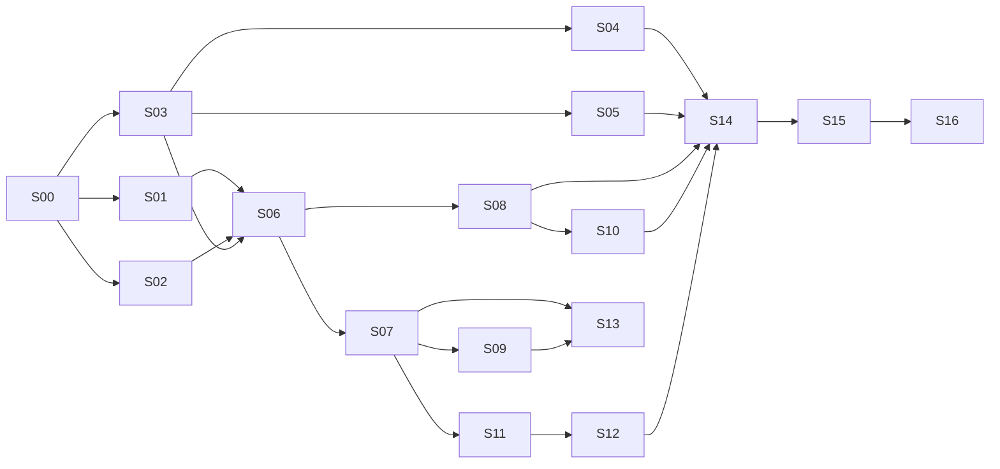

# evalprop — User Stories

The build backlog for evalprop. Each story is a self-contained brief an agent can pick up. It says what to build, how to verify it, which files it may touch, and which sections of [ARCHITECTURE.md](../ARCHITECTURE.md) explain the design. Product-level definitions (personas, the E-numbered catalogue, comp rules) are in [PRODUCT.md](PRODUCT.md).

- **Detailed stories:** the launch scope (S00–S16). **Outlines:** later steps, detailed once launch is in use (ARCHITECTURE §17, rule 7).
- **One story = one PR = one agent.** The product owner reviews against the acceptance criteria and merges.
- **Status values:** `todo` · `in progress` · `in review` · `done` · `blocked`.
- **When a story merges:** set it to `done` with its PR link, fill in its **Outcome** block, and add anything left over to [Known issues and follow-ups](#known-issues-and-follow-ups).

**Starting point:** the repository already contains the tested calculation engine (`src/calc/`, `test/calc.test.ts`, 20 passing tests). S00 creates the monorepo skeleton and S01 moves the engine into `packages/engine`.

---

## Board

| ID | Story | Step | Track | Depends on | Status |
|---|---|---|---|---|---|
| S00 | Repo skeleton, shared contracts, emulators, CI | 0 | Sequential | — | done ([#1](https://github.com/p20y/evalprop/pull/1)) |
| S01 | Adopt and harden the calculation engine | Launch | A: engine | S00 | done ([#2](https://github.com/p20y/evalprop/pull/2), [#4](https://github.com/p20y/evalprop/pull/4)) |
| S02 | Comp selection engine (search ladder, similarity, confidence) | Launch | A: engine | S00 | done ([#3](https://github.com/p20y/evalprop/pull/3)) |
| S03 | Data gateway: provider interfaces, cache, fixtures, usage ledger | Launch | B: data | S00 | in review ([#5](https://github.com/p20y/evalprop/pull/5)) |
| S04 | Property, rent, and sale data provider (spike, then adapter) | Launch | B: data, human review | S03 | in progress (part 1: comparison in review [#6](https://github.com/p20y/evalprop/pull/6), awaiting product owner choice) |
| S05 | Schools adapter | Launch | B: data | S03 | todo |
| S06 | `runAnalysis` pipeline + persistence | Launch | C: connector | S01, S02, S03 | in review ([#7](https://github.com/p20y/evalprop/pull/7)) |
| S07 | MCP server: `analyze_property`, `what_if` | Launch | C: connector | S06 | todo |
| S08 | Hosted report page + share links | Launch | D: report | S01, S06 | in review ([#8](https://github.com/p20y/evalprop/pull/8)) |
| S09 | Inline deal card widget (ChatGPT) | Launch | D: report | S07 | todo |
| S10 | PDF export worker | Launch | D: report | S08 | todo |
| S11 | OAuth sign-in for the connector (spike, then implement) | Launch | E: account, human review | S07 | todo |
| S12 | Plans, quotas, usage metering, Stripe subscription | Launch | E: account | S11 | todo |
| S13 | Tool descriptions + invocation evals | Launch | Sequential, human review | S07, S09 | todo |
| S14 | Integration, degraded states, latency measurement | Launch | Sequential | S04, S05, S08, S10, S12 | todo |
| S15 | Deploy to Google Cloud, observability, cost controls | Launch | Sequential | S14 | todo |
| S16 | Directory submission and Muse adapter | Launch | Sequential | S15, Muse docs | todo |

After S00 is accepted, tracks **A (engine, comps), B (data)** run in parallel. S06 joins them. After S07, **D (report), E (account)** run in parallel. S13 and S14 join everything.

---

## Definition of done (every story)

- All acceptance criteria pass and are demonstrated in the PR description (screenshots for UI stories, sample tool output for connector stories).
- `pnpm lint`, `pnpm typecheck`, and `pnpm test` pass. New logic has unit tests.
- **No test calls a paid API or the network.** Provider responses come from recorded fixtures; Firestore runs on the emulator; Stripe uses test mode and signed sample payloads.
- Only files listed under **May touch** are changed. A needed change outside that list is raised in the PR, not made silently.
- Shared contracts in `packages/shared` change only in S00, or in a story that explicitly lists them.
- **Every number shown to a user comes from `packages/engine` or `packages/comps`.** No story computes finance math anywhere else, and no model output is ever used as a number.
- **Every looked-up figure carries provenance** (provider, fetched-at, cached, confidence). Assumed defaults are labelled `assumed`; user-supplied values `provided`.
- Nothing scrapes Redfin, Zillow, or any listing site.
- Secrets are never committed, logged, or placed in client code.

---

## Step 0: Foundations

### S00 · Repo skeleton, shared contracts, emulators, CI
**As a** developer (human or agent) **I want** a working monorepo with frozen shared contracts and a local backend **so that** parallel stories build against the same interfaces.

**Architecture refs:** §3 Tech stack, §4 Repository layout, §5.1 Tool surface, §6 Data model and rules, §10.1 Provider interface, §17 rules 1 and 5
**Product refs:** E12.1, E12.5

**Acceptance criteria**
- Given a fresh clone, when I run `pnpm install && pnpm test`, then all packages' tests pass without network or emulators.
- Given the repo, then it is a pnpm workspace with `packages/{shared,engine,comps,data,report}` and `apps/{server,pdf-worker,widget}`, each building and type-checking (apps and packages may be near-empty stubs).
- Given `packages/shared`, then it exports zod schemas and TS types for: `PropertyFacts`, `Assumptions`, `ResolvedAssumption` (with `source: provided | listing | lookup | assumed`), `Provenance`, `Resolved<T>`, `RentListing`, `SaleListing`, `Comp` (with `matchReason`, `matchClass: same-building | same-size | different-size`), `CompResult`, `School`, `Evaluation` (a zod mirror of the engine's output types; S01 adds a compile-time equivalence check against the engine), `Analysis`, `ReportModel`, `CardModel`, all four tool inputs/outputs from ARCHITECTURE §5.1, the tool error codes, and `plans.ts` (`free`, `pro` with placeholder limits).
- Given `packages/data`, then it declares the provider interfaces from §10.1 (no implementations yet).
- Given `firestore.rules`, then it denies all client reads and writes, with a rules unit test against the emulator.
- Given `pnpm dev`, then the Firestore and Storage emulators start and `apps/server` serves `GET /health` returning `{ ok: true, engineVersion }`.
- Given `.github/workflows/ci.yml`, then lint, typecheck, and test run on every PR.
- Given `AGENTS.md`, `CLAUDE.md`, and `README.md` at the repo root, then they are present and accurate (they are committed with this backlog and updated here if commands change).
- Given the existing `src/calc` and `test/calc.test.ts`, then they are left in place for S01 to move.

**May touch:** everything (this is the bootstrap story), except `src/calc` and `test/calc.test.ts` (S01 owns the move)
**Must not touch:** `ARCHITECTURE.md` and `docs/PRODUCT.md` (raise changes in the PR)

**Test plan:** schema round-trip test per shared type; rules test (`@firebase/rules-unit-testing`); a `/health` handler test.

**Out of scope:** any business logic, provider code, tool handlers, report rendering.

**Outcome:** Done. pnpm 12 workspace with `packages/{shared,engine,comps,data,report}` and `apps/{server,pdf-worker,widget}`; the last three and `comps`/`report`/`engine` are placeholders until their stories. `packages/shared` exports zod schemas for every contract listed above plus the four tool inputs/outputs, `TOOL_ERROR_CODES`, placeholder `PLANS`, and sample fixtures (9 round-trip and validation tests). `packages/data` declares the provider interfaces with a typed `ProviderFailure`. `apps/server` serves `GET /health` (Hono). `firestore.rules` and `storage.rules` deny all client access, proven by 3 emulator tests (`pnpm test:emulator`, Java 21 via `scripts/with-java.sh`). CI runs lint, typecheck, test, and emulator tests. 20 legacy engine tests still pass from `test/`. Deviations: `pnpm build` is `tsc --noEmit` for now (no bundling needed until S09/S15); the legacy root `tsconfig.json` turns off `noUncheckedIndexedAccess` until S01 moves the engine under the strict base config; `Evaluation` is a mirror schema rather than a re-export (the engine is not yet a package).

---

## Launch scope

### S01 · Adopt and harden the calculation engine
**As an** investor **I want** the financial math to be exact, versioned, and state-aware **so that** I can trust every figure in the report.

**Architecture refs:** §8 Calculation engine, §13 Quality
**Product refs:** E2.1, E2.4, E2.6, E3.1, E3.2, E3.4, E3.5, E3.6

**Acceptance criteria**
- Given the existing engine, when moved to `packages/engine`, then all 20 existing tests pass unchanged (only import paths change), the public API in ARCHITECTURE §8 is exported from the package root, the legacy `src/calc`, `test/`, and root `tsconfig.json` override are removed, and a compile-time check proves the engine's `Evaluation` type is mutually assignable with `EvaluationSchema` in `packages/shared` (including `grossRentMultiplier: number | null`, never `Infinity`).
- Given `ENGINE_VERSION` (semver), then it is exported and covered by a test that fails if formulas change without a version bump (a golden-output snapshot of three reference deals).
- Given a purchase in a state that reassesses property tax on sale (at minimum CA, and the states listed in the story's table file `property-tax-reassessment.ts`, each with a source comment), when the user does not supply property tax, then tax defaults to the state's rate × **purchase price**, and the assumption record says why. Other states use the previous default.
- Given `evals/golden/`, then it holds at least five hand-verified cases (all-cash, leveraged, negative cash flow, high rate, 15-year loan) plus a standalone script that recomputes them independently and a test that compares.
- Given a `PropertyInput` with `offerPrice`, then the engine treats it as the purchase price and reports the discount versus `listPrice` when supplied.
- Given invalid inputs, then `InputError` names the field; zero rent or zero price never yields `NaN`/`Infinity` in the output.
- Given the verdict, then each check returns `actual` and `threshold` strings suitable for display.

**May touch:** `packages/engine/**`, `evals/golden/**`, root `package.json` scripts
**Must not touch:** `packages/shared` (re-export types only; request changes in the PR), `apps/**`

**Test plan:** existing tests; golden cases with an independent recompute script; state tax table tests; property tests for monotonicity (higher rate never increases cash flow, higher rent never decreases it).

**Out of scope:** financing types beyond fixed-rate (1.1), stress case (1.1), after-tax view (later), any I/O.

**Outcome:** Done ([#2](https://github.com/p20y/evalprop/pull/2)). The engine moved with `git mv` into `packages/engine/src/` (legacy `src/`, `test/`, root `tsconfig.json` removed; root `test`/`typecheck` scripts now only run the workspace packages) and compiles under the strict base config with `noUncheckedIndexedAccess` (indexing fixed in `hold.ts`; typed range table in `defaults.ts`). The package root exports `evaluate`, `sensitivity`, `breakEvenRent`, `maxPriceForCashOnCash`, `monthlyPayment`, `balanceAfter`, `irr`, `InputError`, all types, `ENGINE_VERSION = "1.0.0"`, and the tax table helpers; `apps/server` `/health` is untouched and passes. `grossRentMultiplier` is `number | null`. `InputError` carries a `field`. New optional inputs: `offerPrice` (alias of `purchasePrice`; conflicting values are rejected), `listPrice` (result gains optional `listPriceComparison` with discount amount and percent), `state` (two-letter). `property-tax-reassessment.ts` has CA (1.2% of purchase price, Prop 13/19) and FL (1.5%, approximate), each with a source and an `approximate` flag; unsupplied tax in those states defaults to rate x purchase price with an assumption `note`, all other states keep 1.1%. `evals/golden/` has six hand-verified cases (all-cash, leveraged, negative cash flow, high rate, 15-year loan, California offer below list) and `recompute.mjs`, a plain-Node script that does not import the engine; the engine test runs both. A snapshot of three reference deals guards `ENGINE_VERSION` (`pnpm --filter @evalprop/engine snapshot:update` refuses to rewrite a changed snapshot unless the version was bumped). A `*.typecheck.ts` file proves `Evaluation` is mutually assignable with `EvaluationSchema`. Tests: 59 in `packages/engine` (the original 20 plus 39: golden 8, state tax / offer and list price / InputError / finite output / check strings / amortization cross-check 22, seeded property tests 4, shared contract 2, version guard 3), 70 across the repo; no network. Deviations: (1) the 20 original tests changed more than import paths: `!` assertions added in the test file only, because `noUncheckedIndexedAccess` and `grossRentMultiplier: number | null` otherwise fail typecheck; assertions are unchanged. (2) `AssumptionRecord.field` is `string` (not `keyof ResolvedInput`) so the engine type is mutually assignable with the shared schema's `field: z.string()`. (3) The `Evaluation` gains two optional fields that `EvaluationSchema` does not have yet, `listPriceComparison` and `assumptions[].note`; mutual assignability still holds, but `packages/shared` needs matching optional fields (F5). (4) A display bug was fixed on the way: the cash-flow check printed `$-68/mo`; it now prints `-$68/mo`. (5) The CA/FL rates are labelled approximate; other reassessing states (for example MI, NM) were left out because their rates could not be verified.

---

### S02 · Comp selection engine
**As an** investor **I want** rent and sale comps chosen like an experienced investor would **so that** the rent estimate is credible and explainable.

**Architecture refs:** §9 Comparable selection
**Product refs:** E4.1, E4.9, E4.10, E4.11, E4.13 · PRODUCT §4 (rules)

**Acceptance criteria**
- Given a subject profile and a list of candidate listings with distance, type, beds, baths, sqft, date, and kind (asking | leased), when I call `selectRentComps`, then it follows the ladder in §9 exactly: same building first, then strict matches at 0.5, 1, and 2 miles, then relaxed matches (sqft ±30% or adjacent bed count, size-adjusted by rent per sqft), then "insufficient".
- Given ≥ 5 strict comps within 0.5 mile, then the result stops at that step and contains no farther comps.
- Given a building where every unit is a 1-bed of 700–760 sqft, when 1-beds of similar size exist within 1 mile, then no 2-bed comp appears in the result.
- Given no strict comps at any radius, then adjacent-size comps are returned with `matchClass: 'different-size'`, an adjusted rent per sqft estimate, and confidence capped at `low` or `medium` per the rules.
- Given any result, then it includes `estimate { low, median, high }` (25th/50th/75th percentile after outlier trimming), `stepReached`, `radiusUsedMiles`, `confidence`, and per-comp `matchReason` text.
- Given duplicate listings of the same unit, then only the most recent is kept; given comps older than the recency window, then they are excluded unless needed, and the result says so.
- Given the same input, then the output is identical (deterministic, no randomness, no clock reads: `now` is a parameter).
- Given `selectSaleComps`, then it returns the nearest-first comps with price per sqft and a flag when the list price differs from the comps' median by more than a configurable percent.

**May touch:** `packages/comps/**`
**Must not touch:** `packages/shared` (request changes in the PR), any I/O or provider code

**Test plan:** fixture tables for: uniform 1-bed building; sparse suburb needing the 2-mile step; relaxed fallback with size adjustment; insufficient comps; outliers; duplicates; stale listings; tie-breaking. Thresholds live in one `config.ts` so tuning does not touch logic.

**Out of scope:** fetching data, density-based radius (open question 6; leave a config hook), asking-vs-leased price adjustments.

**Outcome:** In review ([#3](https://github.com/p20y/evalprop/pull/3)). `packages/comps` exports `selectRentComps` and `selectSaleComps` (pure, `now` is a parameter), with every threshold in `src/config.ts` and per-call overrides via `options.config`. 58 new tests in the package (stats, rent, sale), none touching the network; outputs validated against `CompResultSchema`.
- Ladder as in §9: same building, strict 0.5/1/2 mi (same type, beds, baths ±1, sqft ±15%, ±10% in a multi-unit building), relaxed (sqft ±30% or beds ±1, rent-per-sqft adjusted, `different-size`), then insufficient. Strict is exhausted across all radii before relaxing.
- "Stop when enough" vs minimum: first step with ≥ 5 comps; if none reaches 5, the narrowest step with ≥ 3 (medium at best); if none reaches 3, the next ladder. Same-building comps count toward every strict step.
- Quality: 180-day window (retry to 365 days only if insufficient, noted, confidence lowered one level), 90-day recency half-life, dedupe on address+beds+sqft, IQR outlier fence before counting, weighted 25th/50th/75th percentile.
- Sale comps: same radii, one size band, sold only by default, `medianPricePerSqft`, `pricePerSqft`, and `listPriceCheck` (flag above 10% by default).
- Deviations: `packages/shared` untouched, so sale-specific numbers ride alongside the `CompResult` fields (F8). Relaxed "or" is literal (F9). Dedupe relies on the unit being in the address (F10).

---

### S03 · Data gateway: provider interfaces, cache, fixtures, usage ledger
**As the** owner **I want** all external data to flow through one gateway with caching, timeouts, and cost tracking **so that** providers are swappable and every report's data cost is visible.

**Architecture refs:** §10 Data layer, §6.2 (`cache`, `usage`), §7.3 Degradation
**Product refs:** E11.1, E11.2, E11.3

**Acceptance criteria**
- Given a provider call through the gateway, then it applies a per-call timeout, one retry for idempotent requests, and returns `Resolved<T>` with provenance (`provider`, `fetchedAt`, `cached`).
- Given a repeat request within its TTL, then the result comes from the Firestore cache (`cached: true`) with no provider call; TTLs are configurable per endpoint and default to ARCHITECTURE §10.4.
- Given each call, then a usage record is produced (provider, endpoint, ms, cached, `costCents` from config) for the pipeline to persist.
- Given a `FixtureProvider`, then it serves recorded responses from `packages/data/fixtures/` for property, rent, sales, and schools and is the default in dev and tests.
- Given a `FakeProvider` configured to time out, error, or return empty, then the gateway returns a typed failure the pipeline can degrade on (never throws an unhandled error).
- Given two concurrent identical requests, then only one provider call is made (in-flight de-duplication).
- Given the gateway, then it never logs request bodies containing user-supplied listing text.

**May touch:** `packages/data/**`, `firestore.indexes.json`
**Must not touch:** `packages/shared` (request changes), `apps/**`

**Test plan:** gateway unit tests with fake clocks; cache tests on the Firestore emulator; concurrency de-duplication test; failure-mode tests.

**Out of scope:** any real provider (S04, S05), pipeline logic.

**Outcome:** In review ([#5](https://github.com/p20y/evalprop/pull/5)). `packages/data` now has `createGateway`: `gateway.property|rent|sales|schools(name, provider)` return objects implementing the same provider interfaces, with a per-attempt timeout (default 3.5 s, overridable per endpoint; the provider's `AbortSignal` is aborted), one retry after 250 ms on `TIMEOUT`/`ERROR`/`RATE_LIMITED` (never on `NOT_FOUND`/`AMBIGUOUS`/`UNAVAILABLE`), in-flight de-duplication by cache key, and typed failures only (a provider that throws, hangs, or returns garbage becomes `ERROR`/`TIMEOUT`; nothing is thrown). Cache: `CacheStore` with `MemoryCacheStore` and `FirestoreCacheStore` (`cache/{key}`: `provider`, `endpoint`, `payload`, `fetchedAt`, `expiresAt` as a native Timestamp), key = sha256 of canonical JSON of provider + endpoint + normalized request, default TTLs from ARCHITECTURE 10.4 and configurable per endpoint or `provider/endpoint` (0 disables). Hits return `cached: true` with the original `fetchedAt`; only successes are cached; cached payloads are re-validated with the shared schemas; a broken or slow store is just a miss. Usage: one `{ provider, endpoint, ms, cached, costCents, outcome, attempts, coalesced }` per call via an injected `onUsage` callback and via `gateway.scope()`, a per-request view that collects its own records (`scope.usage()`) so S06 can persist exactly its calls as `providerCalls[]` in the analysis transaction; cache hits, failures, and coalesced joiners cost 0. The logger is injected (default no-op) and only ever receives primitive fields (provider, endpoint, outcome, attempts, key prefix), never requests, listing text, or provider messages. `FixtureProvider` serves five fictional scenarios from `packages/data/fixtures/` (multi-unit condo with a uniform 1-bed mix and same-building comps, suburban house, sparse rural address, ambiguous address, no data) through all four interfaces; `FakeProvider` can `hang`, `timeout`, `error`, `rate-limited`, `not-found`, `throw`, or return `empty`, as a constant or per call (`failFirst`); `FakeClock` is exported for S06 tests. Tests: 68 in `packages/data` (gateway 34 with a fake clock, cache 6, fixtures 21, fake provider 6, plus the 1 existing interface test; no network) and 8 new emulator tests for the Firestore store and a gateway served from it (11 emulator tests total). Deviations: (1) an optional `CallOptions { signal? }` last parameter was added to every provider interface method; backwards compatible. (2) `packages/data`'s `test` script excludes `*.emulator.test.ts` so `pnpm test` stays emulator-free. (3) Wrappers take the provider name as an argument because the interfaces have no `name`. (4) `FirestoreCacheStore` takes an initialised Admin `Firestore` and imports only types from `firebase-admin`. (5) `firestore.indexes.json` unchanged: the cache is read by document ID only. (6) No Firestore TTL policy is configured (infra, S15).

---

### S04 · Property, rent, and sale data provider (spike, then adapter)
**As the** owner **I want** a licensed data source chosen on evidence **so that** comps and facts are accurate, legal to use, and affordable.

**Architecture refs:** §10.2, §10.5, §9
**Product refs:** E4.1, E4.2, E4.9–E4.11, PRODUCT §6 risks 1–3

**Part 1: spike (product owner reviews before Part 2 starts)**
- Deliver `docs/provider-comparison.md`: at least three candidate providers compared on: address → facts, **radius rental-listing search with bed/bath/sqft filters**, sale comps, rent estimate, tax history, asking vs leased data, coverage, price per call and per month, rate limits, license terms for display/caching/redistribution, and attribution requirements. Include a recorded sample response for each tested call using three real addresses (a condo in a multi-unit building, a suburban house, a sparse/rural address).
- End with a recommendation and the license constraints to record in `docs/SETUP.md`.

**Part 2: adapter (after product owner approves the choice)**

**Acceptance criteria**
- Given the chosen provider, then `PropertyProvider`, `RentProvider`, and `SalesProvider` adapters implement the interfaces from S03, normalizing into the shared types (including `kind: asking | leased`, distance in miles, `date`).
- Given an address, then the adapter returns facts and coordinates, or a typed `AMBIGUOUS` result with candidates, or `NOT_FOUND`.
- Given the three spike addresses, then recorded responses are committed as fixtures and adapter tests run entirely from them.
- Given the provider's license terms, then attribution and caching limits are enforced in code (TTL caps) and listed in `docs/SETUP.md`.
- Given API errors, rate limits, and empty results, then the adapter returns typed failures (no exceptions leaking).
- Given the key, then it is read from configuration; an adapter integration test is **skipped unless** `RUN_LIVE=1` and is never part of `pnpm test`.

**May touch:** `packages/data/src/adapters/<provider>/**`, `packages/data/fixtures/**`, `docs/provider-comparison.md`, `docs/SETUP.md`
**Must not touch:** pipeline, engine, comps, `packages/shared`

**Test plan:** adapter normalization tests from fixtures; one opt-in live smoke script.

**Out of scope:** schools (S05), crime/insurance/flood (1.1), multiple providers at once.

**Outcome:** _Part 1 in review ([#6](https://github.com/p20y/evalprop/pull/6)); part 2 (adapter) not started, waiting for the product owner's choice._ Part 1 delivered `docs/provider-comparison.md` (research only, public pages, no key, no account, no paid or authenticated call) and a clearly marked **proposed** licence section in `docs/SETUP.md`. Candidates examined: RentCast, ATTOM (and Estated, now being folded into it), HouseCanary, Rentometer, Zillow Group/Bridge, Realtor.com, Cotality, BatchData, plus GreatSchools, SchoolDigger, ATTOM schools and NCES EDGE for schools. Recommendation: **RentCast** for property, rent and sales (only verified radius rental-listing search with bed/bath/sqft filters; published prices; licence permits display, storage and redistribution without attribution; about $0.23 per cold analysis at 6 calls on the $199 Growth plan, about $229 per 1,000 analyses). Rents are **asking only**. Schools have no clean fit: self-serve GreatSchools forbids caching and sharing and lacks assigned schools and 1-10 ratings; proposed path is free NCES locations at launch plus SchoolDigger Pro ($89/mo, 24 h cache cap) if it confirms terms in writing. Deviations from the brief: (1) the recorded sample responses for three real addresses are **not** delivered because there is no key; the comparison doc has a trial-key checklist (section 5) to produce them on RentCast's free tier. (2) Licence terms were read through a page-summarising fetch tool and some pages were unreachable (SchoolDigger docs, Zillow Public Data Terms, Realtor.com); each claim is tagged verified, secondary, or unconfirmed. Still needed from the product owner: provider and schools choice, the three real test addresses, who creates the trial key, and written licence confirmation (AI-assistant display, snapshot retention).

---

### S05 · Schools adapter
**As an** investor **I want** the schools that serve a property **so that** I can judge family-rental demand.

**Architecture refs:** §10.3, §12 (fair housing)
**Product refs:** E4.5

**Acceptance criteria**
- Given a location, then the adapter returns assigned elementary, middle, and high schools (by attendance zone where the provider supports it) with name, level, rating, distance, and provenance; plus other schools within 1–2 miles.
- Given a provider that cannot return zone assignment, then results are labelled "nearby, not confirmed as assigned".
- Given display, then the returned object carries the attribution text required by the provider's license.
- Given no data, then the result is a typed `UNAVAILABLE` and the pipeline omits the section with a note.
- Given fixtures for three locations (urban, suburban, rural), then tests pass offline.

**May touch:** `packages/data/src/adapters/schools/**`, `packages/data/fixtures/schools/**`, `docs/SETUP.md`
**Must not touch:** everything else

**Test plan:** normalization tests from fixtures; attribution presence test.

**Out of scope:** crime, growth, flood, insurance, demographics.

**Outcome:** _(filled in when merged)_

---

### S06 · `runAnalysis` pipeline + persistence
**As the** system **I want** one orchestration from address to saved analysis **so that** every tool and the report share exactly the same logic.

**Architecture refs:** §7 Analysis pipeline, §6.2, §5.1 rule 2, §7.3 degradation, §7.4 latency
**Product refs:** E1.1–E1.3, E1.5, E2.2, E2.3, E3.2, E3.5, E7.1, E11.1, E11.2, E12.5

**Acceptance criteria**
- Given a request (address + optional listing + assumptions), then stages 1–8 run in order with stage 3 in parallel, and the result is a saved `Analysis` (immutable) containing facts, resolved assumptions with sources, the engine `Evaluation`, market data (comps, schools, provenance, confidence), advisory flags, `engineVersion`, `pipelineVersion`, `inputHash`, and `dataNotes`.
- Given assumption precedence **user-provided > listing-provided > looked-up > assumed default**, then each field's `source` is correct; tests cover every precedence pair.
- Given provider failures, timeouts, or empty data, then the pipeline degrades per ARCHITECTURE §7.3 (table-driven tests for each row) and always records what degraded in `dataNotes`.
- Given no usable rent from any source and none supplied, then the verdict is withheld with a clear `NEEDS_RENT` result (never a guessed number).
- Given an ambiguous address, then it returns candidates (`AMBIGUOUS_ADDRESS`) and creates nothing.
- Given the same `(uid, inputHash)` within 10 minutes, then the existing analysis is returned (idempotent, no second usage event).
- Given `what_if(baseAnalysisId, overrides)`, then it loads the owner's analysis, reuses its market data, re-runs stages 5–8, saves a new analysis with `baseAnalysisId`, and returns before/after rows for cash flow, cash-on-cash, DSCR, break-even, IRR; a different owner gets `NOT_FOUND`.
- Given listing text/description supplied by the assistant, then it is stored and displayed but never influences any calculation (test with an adversarial description).
- Given a run, then a usage event with provider calls and stage timings is written in the same transaction as the analysis.

**May touch:** `apps/server/src/pipeline/**`, `apps/server/src/repos/**`, `packages/shared` (only to add fields listed in the PR for approval)
**Must not touch:** engine and comps internals, MCP/transport code, report rendering

**Test plan:** pipeline tests against `FixtureProvider`/`FakeProvider` and the Firestore emulator; precedence matrix; degradation table; idempotency; owner isolation; adversarial listing text.

**Out of scope:** MCP wiring (S07), quotas and plans (S12), PDF.

**Outcome:** In review ([#7](https://github.com/p20y/evalprop/pull/7)). `apps/server/src/pipeline/` exports `runAnalysis({ uid, input }, ctx)` and `runWhatIf({ uid, input }, ctx)` (never throw: a typed `PipelineFailure` with a stable `ToolError`, `dataNotes`, and, for `NEEDS_RENT`, the resolved facts), plus `PIPELINE_VERSION` (1.0.0, stored next to `ENGINE_VERSION` on every analysis), `buildCard`, `buildSummary`, `buildComparisonRows` and `buildWhatIfSummary` (pure functions of a saved analysis: S07 and S08 can rebuild the same card and text from a read). Stages: (1) zod-validate with the shared schemas, standardize the address, `inputHash` = sha256 of canonical JSON; (2) property lookup through `gateway.scope()` (listing fields override looked-up facts, noted in `dataNotes`; ambiguous → `AMBIGUOUS_ADDRESS` with candidates, nothing saved; not found with a price and a parseable city/state continues from the user's data, otherwise `NOT_FOUND`); (3) five calls in parallel under one 5 s deadline on top of the gateway's per-call timeout (rent candidates, sale candidates, assigned schools, nearby schools, rent estimate); (4) `selectRentComps`/`selectSaleComps`; (5) per-field precedence provided > listing > lookup > assumed, recorded as `source` + `note` + `provenance` in `Analysis.assumptions` (offer price and rent included); (6) `evaluate`, `maxPriceForCashOnCash`, `breakEvenRent` with `state` and `listPrice`; (7) one Firestore transaction writes `analyses/{id}`, `users/{uid}/usage/{eventId}` (provider calls from the scope, stage timings, cost) and an idempotency marker; (8) card and summary built from the saved analysis. Rent: provided > listing actual rent > comps median (confidence at least medium, or at least three comps) > provider estimate (provenance forced to low, warning note) > `NEEDS_RENT`, verdict withheld. Price: offer > listing price > provider list price, else `INVALID_ASSUMPTION` on `offerPrice`. Tax and HOA: provided > listing > property record > engine default (state reassessment through `state`). Quota: injectable `ctx.quota` (`reserve(uid, kind)` → ok | `QUOTA_EXCEEDED`, `release`) with a no-op default, called after the idempotency lookup and before the first provider call, released on any failure and on an idempotent race loss. Idempotency: same `(uid, inputHash)` within 10 minutes returns the saved analysis with no quota, no provider call and no second usage event, also under concurrency (the check is inside the transaction). What-if: owner-checked load (someone else's id is `NOT_FOUND`, same as missing), no gateway or provider call at all, stored market data reused, provided/listing/lookup values carried over, assumed ones re-derived by the engine, new analysis with `baseAnalysisId`, six before/after `ComparisonRow`s. `apps/server/src/repos/`: `AnalysisRepo` (`createIfNew`, `get(id, ownerUid)`, `findRecent`) and `UsageRepo`, with `InMemoryAnalysisRepo` and `FirestoreAnalysisRepo` passing one shared behaviour contract; ids are `crypto.randomBytes(18)` base64url with a prefix. Tests: 178 pipeline and 15 repo unit tests in `apps/server` (193 total with the health test; no network), including the precedence matrix over every subset of provided/listing/lookup for offer price, tax, HOA and rent, a table for every row of §7.3 across five failure modes, ordering and rollback of the quota hook, owner isolation, what-if with zero provider calls, an adversarial description and advisory flags, a persisted-analysis-parses-against-`AnalysisSchema` check, and a summary-number check that has teeth (a doctored number fails it); 19 new emulator tests (30 total) run the repo contract and the full pipeline on Firestore. Deviations: (1) `apps/server/package.json` gained `@evalprop/comps`, `@evalprop/data`, `firebase-admin` and an emulator-excluding test script (outside the story's May touch, required to build it); `pnpm-lock.yaml` followed. (2) No change to `packages/shared`; the changes it would benefit from are F18 and F19. (3) `users/{uid}/idempotency/{inputHash}` is an extra collection not in the ARCHITECTURE §6.2 table; it makes the idempotency check a single document read inside the transaction (see F22). (4) Candidates are fetched once at the widest radius (2 mi) and `packages/comps` filters by distance: the ladder needs successive radii, but a 2-mile result already contains every closer listing with its `distanceMiles`, so three calls would triple cost and latency for the same information. (5) `AnalysisRepo.get(id, ownerUid)` returns `Analysis | null` so it can be wired to S08's `AnalysisReader`. (6) Saved `market.saleComps` keeps the comps package's extra fields (`listPriceCheck`, `pricePerSqft`, `medianPricePerSqft`); the Firestore repo validates reads with `AnalysisSchema` but returns the raw document so nothing saved is dropped (F8).

---

### S07 · MCP server: `analyze_property` and `what_if`
**As an** investor **I want** to ask in chat and get an analysis **so that** I never leave the assistant.

**Architecture refs:** §5.1, §5.2, §6.1
**Product refs:** E1.1, E7.1, E7.3, E7.4, E12.1

**Acceptance criteria**
- Given a standard MCP client over Streamable HTTP, then `/mcp` lists `analyze_property` and `what_if` with the descriptions and input schemas from `packages/shared`, and calls them.
- Given a valid `analyze_property` call, then the response has `structuredContent` (the `CardModel`), a short text summary (verdict, the lever that matters, any data caveat), the report URL, and `_meta` with the full evaluation and provenance.
- Given invalid or ambiguous input, then the MCP tool error carries the stable codes from §5.1 (`NEEDS_ADDRESS`, `AMBIGUOUS_ADDRESS` with candidates, `INVALID_ASSUMPTION` naming the field).
- Given `what_if`, then the response includes before/after rows and the new report URL.
- Given `AuthProvider` (interface only here, `FakeAuthProvider` implemented), then every call requires a bearer token and resolves a `uid`; calls without one are rejected.
- Given handlers, then they contain only validation and a call to `runAnalysis`; no business logic.
- Given a summary text, then every number in it is generated from the saved analysis (a test asserts that numbers in the text equal numbers in the structured content).

**May touch:** `apps/server/src/mcp/**`, `apps/server/src/auth/interface.ts`, `apps/server/src/auth/fake.ts`
**Must not touch:** pipeline internals, engine, comps, `packages/shared` (read-only)

**Test plan:** contract tests through an in-process MCP client; error-code tests; summary/number consistency test; auth-required test.

**Out of scope:** real OAuth (S11), `compare_properties` and `create_report` (outlined below; `create_report` basics land with S08).

**Outcome:** _(filled in when merged)_

---

### S08 · Hosted report page + share links
**As an** investor **I want** a rich, professional report I can forward **so that** partners, lenders, and clients can read it without an account.

**Architecture refs:** §11 Report, §5.7, §6.2 (`reports`), §12
**Product refs:** E6.1, E6.4, E6.5, E3.1, E3.2, E3.4–E3.6, E4.1, E4.2, E4.5, E11.1

**Design input:** `docs/PRODUCT.md` §4 and the chat/comps mockups discussed during design (verdict banner, four KPIs, scorecard, max offer, income/expenses, returns with rules of thumb, hold chart with break-even, sensitivity heat grids, comps with match reasons, schools, assumptions table with source badges, disclaimer). The product owner reviews the rendered report visually.

**Acceptance criteria**
- Given a saved analysis, when `renderReport(model)` runs, then it returns one self-contained HTML document with every section in ARCHITECTURE §11, inline CSS and inline SVG charts (no external requests), and a hover tooltip on the hold chart.
- Given the executive summary, then every sentence is generated from engine/comps output (no free text from a model); a test checks each numeric token against the analysis.
- Given sensitivity grids, then cells carry their numbers (color is never the only signal) and the base case is marked; the hold chart has a legend, direct labels, and a table view of the same figures.
- Given status indicators (pass/fail, confidence), then each has an icon and a text label.
- Given the assumptions table, then each value shows `Provided`, `From listing`, `Looked up (source, date)`, or `Assumed default`.
- Given the comps section, then each comp row shows distance, size, rent, asking/leased, and its `matchReason`, and the section states the ladder step and confidence; fallback (different-size) comps are visibly tagged.
- Given `create_report` (core only), then it creates a `reports` document with a 128-bit random token (only its hash stored), returns the `/r/:token` URL, supports `revokedAt` and optional expiry, and `GET /r/:token` serves the page with `noindex` or 404/410 when revoked or expired.
- Given a 375px-wide viewport, then there is no horizontal page scroll; given print, then page breaks are sensible and nothing is cut off.
- Given missing sections (e.g. no schools), then the report omits them and shows the data note rather than empty boxes.
- Given the free tier flag, then a watermark option renders (plan logic arrives in S12).

**May touch:** `packages/report/**`, `apps/server/src/routes/report.ts`, `apps/server/src/mcp/create-report.ts`, `evals/report-fixtures/**`
**Must not touch:** engine, comps, pipeline, `packages/shared` (read-only)

**Test plan:** snapshot test of the rendered HTML for three fixture analyses (strong, marginal, degraded data); numeric-token consistency test; token hashing and revocation tests; an accessibility pass (contrast, labels); screenshots at 375px and desktop attached to the PR.

**Out of scope:** PDF (S10), branding (1.1), client-side recalculation (1.2), `compare_properties`.

**Outcome:** (in review) All acceptance criteria are met and demonstrated in the PR (screenshots of three fixture reports at desktop and 375px under `evals/report-fixtures/screenshots/`).
- `packages/report`: `renderReport(model)` is a pure function that returns one self-contained HTML document (inline CSS, inline SVG, one hashed inline script for the hold-chart tooltip, no external requests). It renders every §11 section, omits missing ones and explains the gap in a data-notes section, and renders a watermark banner plus background mark when `options.watermark` is true. `engineInputFromAnalysis` rebuilds the engine input from a saved analysis (checked to reproduce the stored numbers; if it cannot, the sensitivity grids are left out with a note). `buildSummary` generates every executive-summary sentence from analysis fields only.
- `apps/server`: `ReportStore` (in-memory and Firestore `reports/{reportId}`), `AnalysisReader` interface, `GET /r/:token`, `createReport` and `revokeReport` core handlers (not registered in an MCP server; that is S07). `createApp({ reports, analyses })` mounts the route; with no deps the app is unchanged.
- Decisions: tokens are `randomBytes(16)` base64url and only the SHA-256 hash is stored. A malformed, unknown, or orphaned-report token is 404; a revoked or expired link is 410 Gone (only a holder of the unguessable token can see the difference). Pages are `private, max-age=60` with an ETag (record id + version + renderer version) so revalidation costs a read but no render; every response has `noindex` (meta and `X-Robots-Tag`), `Referrer-Policy: no-referrer`, and a CSP that allows only the one hashed script.
- Tests: report 75, server 35 unit (`pnpm test`), 10 Firestore-emulator tests for the store (`pnpm test:emulator`). Snapshots are the committed `evals/report-fixtures/*.html` (regenerate with `pnpm --filter @evalprop/report fixtures:update`).
- Deviations: `apps/server/src/app.ts`, `apps/server/package.json` (firebase-admin, zod, @evalprop/report; the test script now skips `*.emulator.test.ts` so `pnpm test` needs no emulator), and `packages/report/package.json` (engine dependency) were touched because wiring and dependencies required it. Sale-comp price per sqft and the list-price check are not shown as separate figures (F8); the comp's `matchReason` already carries `$/sqft`.

---

### S09 · Inline deal card widget (ChatGPT)
**As an** investor **I want** a compact card in the chat **so that** I see the verdict and key numbers at a glance.

**Architecture refs:** §5.3, §5.1 (output shape)
**Product refs:** E7.4, E12.3 (pulled forward for ChatGPT)

**Acceptance criteria**
- Given a `CardModel`, then the widget renders: address, verdict pill (icon + label), four metric tiles (cash flow, cash-on-cash, cap rate, DSCR), max offer, break-even, 10-year IRR, comps confidence, and buttons "Open full report" and "Change assumptions".
- Given a what-if result, then the widget renders a before/after comparison table.
- Given the widget, then it is a pure function of `structuredContent`, holds no secrets, and makes no network calls.
- Given light and dark themes and a narrow width, then the layout holds without overflow.
- Before building, the implementer **re-reads OpenAI's current developer documentation** for widget registration, supported metadata, and sandbox limits, and records the exact mechanism and doc links at the top of the PR description.

**May touch:** `apps/widget/**`, `apps/server/src/mcp/widget-registration.ts`
**Must not touch:** pipeline, engine, report package

**Test plan:** component tests with fixture card models (strong, marginal, weak, degraded); visual screenshots in the PR.

**Out of scope:** Muse card (S16), compare view, editing assumptions inside the card (button hands back to the conversation).

**Outcome:** _(filled in when merged)_

---

### S10 · PDF export worker
**As an** investor **I want** a PDF that looks as good as the web report **so that** I can email or print it.

**Architecture refs:** §11, §14 (pdf-worker), §6.2
**Product refs:** E6.2

**Acceptance criteria**
- Given a report ID, when `create_report` is called, then a Cloud Task is enqueued and the worker renders the report HTML to PDF with headless Chromium and stores it in the private bucket; `GET /r/:token/pdf` redirects to a short-lived signed URL.
- Given the PDF, then charts and tables are intact, page breaks avoid splitting a section's heading from its content, and the footer carries the disclaimer and page numbers.
- Given the worker fails or times out, then the web report is unaffected, the PDF link shows "preparing" and the task retries with backoff; the failure is logged with the report ID.
- Given the worker endpoint, then it accepts only authenticated service-to-service calls.
- Locally, a script renders a fixture report to `./out/sample.pdf` without Cloud Tasks.

**May touch:** `apps/pdf-worker/**`, `apps/server/src/jobs/pdf.ts`
**Must not touch:** `packages/report` (request changes in the PR)

**Test plan:** worker handler tests with a stub renderer; a local render smoke script; signed-URL expiry test.

**Out of scope:** branded covers, multi-report bundles.

**Outcome:** _(filled in when merged)_

---

### S11 · OAuth sign-in for the connector (spike, then implement)
**As an** investor **I want** to connect my account once inside the assistant **so that** my analyses and plan follow me.

**Architecture refs:** §5.5, §12
**Product refs:** E10.2

**Part 1: spike (product owner reviews)**
- Deliver `docs/auth-comparison.md`: compare at least three managed auth vendors on MCP-style OAuth (protected-resource metadata, authorization-server discovery, dynamic client registration, PKCE), tested by connecting a real MCP client and ChatGPT's connector flow where available. Include price, social login, and migration risk. Recommend one.

**Part 2: implement**

**Acceptance criteria**
- Given the chosen vendor, then `/.well-known/oauth-protected-resource` is published and an MCP client completes the OAuth flow end to end against a dev tenant.
- Given a valid token, then `AuthProvider.verifyAccessToken` returns `{ uid, email }`; expired, malformed, wrong-audience, and revoked tokens are rejected with the correct challenge.
- Given a first successful call, then `users/{uid}` is created with `plan: 'free'`.
- Given `FakeAuthProvider`, then local development and tests still work unchanged.
- Given logs, then no tokens or emails appear.

**May touch:** `apps/server/src/auth/**`, `docs/auth-comparison.md`, `docs/SETUP.md`
**Must not touch:** pipeline, tools' handler logic

**Test plan:** token verification tests with signed test tokens; an end-to-end OAuth walkthrough recorded in the PR.

**Out of scope:** an account web page, team seats, password management (the vendor owns them).

**Outcome:** _(filled in when merged)_

---

### S12 · Plans, quotas, usage metering, Stripe subscription
**As the** owner **I want** a free tier and a paid plan that are enforced automatically **so that** the product can earn revenue without manual work.

**Architecture refs:** §5.6, §6.2, §14 (cost controls)
**Product refs:** E10.1, E10.3, E10.4, E10.7

**Acceptance criteria**
- Given `packages/shared/plans.ts`, then `free` and `pro` define monthly analysis and what-if allowances, report watermark, and the numbers are product-owner-editable in that one file.
- Given a billable call, then the monthly counter on `users/{uid}` is incremented in a transaction **before** provider calls, rolled back if the pipeline fails, and `QUOTA_EXCEEDED` (with upgrade link and remaining/limit) is returned before any provider cost is incurred.
- Given a free-tier analysis, then the report is watermarked per the plan; given `pro`, no watermark.
- Given Stripe Checkout (test mode), when a user subscribes, then the `/webhooks/stripe` handler (signature-verified, idempotent via `stripeEvents`) sets `plan: 'pro'`; cancellation or failed payment reverts per the subscription state.
- Given each tool response, then it includes usage (used / limit for the period).
- Given an internal admin script (`pnpm admin:usage`), then it prints per-user usage and data cost per report from the ledger.

**May touch:** `apps/server/src/billing/**`, `apps/server/src/quota/**`, `packages/shared/src/plans.ts`, `scripts/admin-usage.ts`
**Must not touch:** engine, comps, pipeline internals (the quota hook is a documented call in `runAnalysis`; add only that hook)

**Test plan:** transaction tests on the emulator (concurrent calls cannot exceed the limit); webhook tests with signed sample payloads incl. duplicates; rollback test.

**Out of scope:** annual plans, coupons, agent plan and branding, team seats.

**Outcome:** _(filled in when merged)_

---

### S13 · Tool descriptions + invocation evals
**As the** owner **I want** the assistant to call the tool at the right moments **so that** users never need to say "use evalprop".

**Architecture refs:** §5.2, §13
**Product refs:** E7.3, E12.2

**Acceptance criteria**
- Given `evals/invocation/prompts.json` with at least 40 labelled prompts (should call `analyze_property`; should call `what_if`; should not call; ambiguous), then a runner script reports precision/recall per tool.
- Given real runs against ChatGPT (and any other available MCP client), then results are recorded in the PR with the model/version and date.
- Given misses, then tool names/descriptions in `packages/shared/src/tools.ts` are revised and the set is re-run until the targets are met: ≥ 90% correct on should-call, ≤ 5% false positives. If targets cannot be met, the PR explains why.
- Given the descriptions, then they state when to use and when not to, and include one worked example call.

**May touch:** `evals/invocation/**`, tool descriptions in `packages/shared/src/tools.ts`
**Must not touch:** schemas (only description strings)

**Test plan:** the eval itself; a unit test that descriptions stay within length limits.

**Out of scope:** automated nightly runs against paid assistants.

**Outcome:** _(filled in when merged)_

---

### S14 · Integration, degraded states, latency measurement
**As the** owner **I want** the whole flow proven end to end **so that** launch is safe and the speed claims are real.

**Architecture refs:** §7.3, §7.4, §13
**Product refs:** E11.2, E11.3, E11.4

**Acceptance criteria**
- Given the real provider (paid, manual run) and five addresses (condo in a multi-unit building, suburban house, sparse area, ambiguous address, address with no data), then an end-to-end script runs `analyze_property` → `what_if` → `create_report` and records per-stage timings, provider cost, cache behaviour, and the comps ladder step reached.
- Given the recorded timings, then p95 cold and warm results are compared with the §7.4 budget in `docs/performance.md`; any stage over budget gets a follow-up in Known issues.
- Given forced provider failures (fake provider), then every row of §7.3 is demonstrated end to end and each produces a clear, honest message in chat and in the report.
- Given three reports (strong, marginal, weak deals), then the product owner reviews the rendered output and the chat summaries for tone and accuracy.
- Given the checklist in PRODUCT §6 (risks), then each item has a recorded status.

**May touch:** `scripts/e2e/**`, `docs/performance.md`, bug fixes anywhere listed in the PR (each fix explained)
**Must not touch:** nothing off-limits, but changes outside the listed areas are called out

**Test plan:** the e2e script (manual, paid); automated degraded-state tests (offline).

**Out of scope:** load testing beyond a handful of concurrent users.

**Outcome:** _(filled in when merged)_

---

### S15 · Deploy to Google Cloud, observability, cost controls
**As the** owner **I want** a repeatable, monitored deployment **so that** I can launch and operate with confidence.

**Architecture refs:** §14
**Product refs:** E10.7, E11.6, E11.5

**Acceptance criteria**
- Given `docs/SETUP.md`, then it lists exactly what the product owner provides (GCP projects and billing, provider key, auth vendor tenant, Stripe account) and the one-time setup commands.
- Given a merge to `main`, then GitHub Actions builds the images, pushes to Artifact Registry, and deploys to `dev`; `prod` deploys only on manual approval.
- Given the deployment, then `evalprop-server` runs with min 1 instance and CPU boost; the PDF worker scales to zero; secrets come from Secret Manager; the bucket is private.
- Given monitoring, then a dashboard shows p95 latency, error rate, cache hit rate, and data cost per report; an uptime check hits `/health`; Error Reporting is enabled.
- Given cost controls, then a budget alert and a billing kill-switch are configured and tested in `dev`.
- Given privacy, then a documented **delete my data** path removes a user's analyses, reports, and PDFs on request.
- Given launch gates, then the checklist records: legal review of disclaimers and fair-housing framing complete; Terms and Privacy pages published.
- **Deploying to the real prod project happens only when the product owner asks.**

**May touch:** `.github/workflows/**`, `infra/**`, `Dockerfile`s, `docs/SETUP.md`, `apps/server/src/observability/**`
**Must not touch:** product logic

**Test plan:** deploy to `dev`, run the S14 e2e script against it, attach results.

**Out of scope:** multi-region, autoscaling tuning beyond defaults.

**Outcome:** _(filled in when merged)_

---

### S16 · Directory submission and Muse adapter
**As the** owner **I want** the connector listed in ChatGPT and available in Muse **so that** users can find and use it.

**Architecture refs:** §5.3, §5.4, §12
**Product refs:** E12.4

**Acceptance criteria**
- Given OpenAI's current submission requirements (re-read at build time), then all required assets, policies, test accounts, and demo prompts are prepared and the submission checklist is complete.
- Given Meta Muse's developer documentation (**provided by the product owner; this story is blocked until it is**), then a design note states what Muse supports (tool protocol, UI, auth, billing policy) and the adapter is built accordingly as a thin layer over `runAnalysis`/the MCP endpoint.
- Given either platform, then no engine, pipeline, or data code changes for the adapter.

**May touch:** `apps/server/src/adapters/**`, `docs/**`
**Must not touch:** engine, comps, pipeline

**Test plan:** adapter contract tests; a recorded walkthrough on each platform.

**Out of scope:** platforms other than ChatGPT and Muse.

**Outcome:** _(filled in when merged)_

---

## Later steps (outlines only, detailed after launch)

- **Step 1.1: sticky and agent-ready.** `compare_properties` (E7.2); saved deals and shortlist (E8.1–8.2); investor criteria profile (E3.3); stress case (E3.7); financing types (E2.5); neighborhood context: crime, rental demand, growth, insurance, flood, local rules (E4.3, E4.4, E4.6–E4.8, E4.12); advisory flags and suggested adjustments (E5.1–E5.2); branding and client-ready sharing, section toggles, notes (E6.3, E6.6, E10.5); report refresh/versions (E6.8); Excel/Google Sheets export with live formulas (E6.9); multi-unit input (E1.6); listing-provided income/expenses (E1.4).
- **Step 1.2: more strategies.** Mid-term, short-term rental, value-add/BRRRR and rehab modelling (E9.1–E9.3, E2.7); interactive client scenarios on shared reports (E6.7); questions to ask the seller (E5.3).
- **Later.** Portfolio tracking and hold/sell/refi (E8.3–8.4); alerts (E8.5); after-tax view (E2.8); house hack and flip (E9.4–9.5); team seats (E10.6).

---

## Known issues and follow-ups

| # | Item | Raised in | Status |
|---|---|---|---|
| F1 | Verdict thresholds (cash flow > 0, CoC ≥ 8%, cap ≥ 6%, DSCR ≥ 1.25) are the author's defaults; product owner to confirm or replace before launch | Design | open |
| F2 | Default rate (6.75%) and expense defaults are placeholders; revisit with current market data before launch and on a schedule | Design | open |
| F3 | Open questions 1–8 in ARCHITECTURE §15 (auth vendor, data provider, pricing, Muse docs, comp ladder order, rural radius, short-term rental, GCP ownership) | Design | open |
| F4 | A draft report renderer was prototyped locally during design but is intentionally not part of the repo; S08 builds the report from the spec and approved mockups | Design | open |

| F5 | ~~`EvaluationSchema` needed `assumptions[].note` and `listPriceComparison`~~ (added in the S01 follow-up PR). Still open: consider reusing `ENGINE_VERSION` from the engine in `Analysis.engineVersion` | S01 | done |
| F6 | State property-tax reassessment table covers CA and FL only, with approximate rates; add MI, NM, SC and others once a source and rate are confirmed, and refresh on the F2 schedule | S01 | open |
| F7 | ~~`README.md` and `ARCHITECTURE.md` still said the engine lives in `src/calc/`~~ | S01 | done (docs follow-up PR) |
| F8 | `CompResultSchema` has no field for sale price per sqft or the list-price check, so `selectSaleComps` returns them as extra properties (`medianPricePerSqft`, `pricePerSqft`, `listPriceCheck`) that a plain `CompResultSchema.parse` strips. S06/S08 should add them to the shared schema (a story that lists `packages/shared`) before the report shows them | S02 | open |
| F9 | Relaxed rent matching implements "sqft ±30% OR adjacent bed count" literally, so a comp with a distant bed count but similar sqft can qualify. Product owner to confirm or require beds within ±1 always | S02 | open |
| F10 | Rent dedupe key is normalized address + beds + sqft and assumes the provider's address includes the unit number; if S04's provider omits it, units in a uniform building collapse into one comp. Verify against real payloads in S04 | S02 | open |
| F11 | Comp thresholds (180-day window, 90-day half-life, ±15%/±10%/±30% bands, IQR fence, 365-day fallback, 10% sale flag) are first-draft defaults in `packages/comps/src/config.ts`; calibrate against real provider data once S04 lands. Density-based radius (open question 6) still a reserved config hook only | S02 | open |
| F12 | The gateway caches empty successful results (for example no rent comps) like any success. A transient empty from a provider would be pinned for 24 h to 90 d; decide in S04 whether empties get a shorter TTL | S03 | open |
| F13 | Expired `cache/{key}` documents are never deleted. Attach a Firestore TTL policy to `cache.expiresAt` (stored as a Timestamp) when infra is set up | S03 (for S15) | open |
| F14 | In-flight de-duplication is per process: concurrent identical requests that land on different Cloud Run instances each call the provider once. No circuit breaker or provider-side rate limiting yet; revisit with real provider quotas in S04 | S03 | open |
| F15 | The gateway's default 90-day TTL for `schools.assigned` and `schools.nearby` (`packages/data/src/cache.ts`) conflicts with likely school-data licences: SchoolDigger and ATTOM trial terms cap caching at 24 hours, and GreatSchools self-serve forbids caching. TTLs must be capped per provider (a licence-derived maximum) when S05 picks a source. See `docs/provider-comparison.md` §4.2 | S04 | open |
| F16 | S04 part 1 could not record sample responses for the three spike addresses (no key). Part 2 must produce them on a trial key (checklist in `docs/provider-comparison.md` §5) before adapter fixtures are committed; confirm first that committing provider responses to the repository is allowed by the licence | S04 | open |
| F17 | Provider licence confirmations are outstanding: display inside third-party AI assistants, retention of report snapshots behind share links, free-tier terms, and whether the NCES "statistical purposes only" agreement applies to EDGE data. Get written answers and update the proposed section in `docs/SETUP.md` | S04 | open |
| F18 | The shared tool error codes have no `NEEDS_PRICE`. When no price is known (no offer, no listing price, no provider list price) the pipeline returns `INVALID_ASSUMPTION` with `field: "offerPrice"`. Add a `NEEDS_PRICE` code to `TOOL_ERROR_CODES` (a story that lists `packages/shared`) if S07 wants the assistant to treat it like `NEEDS_RENT` | S06 | open |
| F19 | `PropertyFacts` and `Analysis.property` carry no per-field source, so "this bed count came from the listing, not the property record" is only a `dataNotes` line. Add a `sources` map (or per-field provenance) to the shared contract if the report should badge each fact | S06 | open |
| F20 | Property tax in a state that reassesses on sale: by the brief's precedence a figure from the listing or the property record (the seller's bill) beats the engine's reassessed default, with a warning and the engine estimate quoted; a what-if that changes the offer price replaces such a figure with the reassessed estimate. Product owner to decide whether reassessing states should prefer the engine estimate from the start (PRODUCT E2.4) | S06 | open |
| F21 | A run that fails after provider calls (`NEEDS_RENT`, an ambiguous address, an engine error) incurs data cost but writes no usage event, because the ledger entry is written with the analysis. Cost of abandoned runs is invisible; add a failed-run usage event (type, `providerCalls`, no `analysisId`) if the cost matters, or sample it in S14 | S06 | open |
| F22 | `users/{uid}/idempotency/{inputHash}` (`{ analysisId, createdAt }`) is an implementation detail of the idempotency check and is missing from the ARCHITECTURE §6.2 table; add it there. It is overwritten by each new analysis for that input and is never read by anything but the repo | S06 | open |
| F23 | `PipelineContext.reportUrl` defaults to the relative path `/report/{analysisId}`. S07/S08 must supply the real URL; note a share link is created by `create_report` (a hashed token), so decide whether the card's report link is a signed in-app route for the owner or a token minted at analysis time | S06 | open |
| F24 | `QuotaGate` is an interface with a no-op default. S12 implements it (plans, the per-month counter, the upgrade link) and must keep two properties tested here: `reserve` runs before any provider call, and `release` is idempotent and tolerates being called late. A reservation leaked by a crash between `reserve` and `release` is not reconciled by this story | S06 (for S12) | open |
| F25 | A listing URL alone yields `NEEDS_ADDRESS`: nothing resolves a Redfin/Zillow link to an address (no scraping, AGENTS.md). The assistant must pass the address it read from the page; decide in S07/S13 whether a non-scraping resolver is wanted | S06 | open |
| F26 | `Analysis` does not carry what the report would like to show or reuse: the engine `PropertyInput` it was run with (S08 rebuilds it from `assumptions` and `evaluation`, relying on S06 recording `purchasePrice` (or `offerPrice`) and `monthlyRent` as resolved assumptions and on engine defaults not drifting; if they drift the sensitivity grids are hidden), the max-offer-vs-price percentage, and the sale `pricePerSqft`/`listPriceCheck` (see F8). Consider adding `engineInput` and these fields to `AnalysisSchema` in S06 | S08 | open |
| F27 | `revokeReport` and the store's `list` exist but no tool, route, or screen calls them yet, so a user cannot actually turn a link off or see their links. Decide where this lives (an MCP tool in S07, or an account page) | S08 | open |
| F28 | `apps/server/src/index.ts` does not construct a `FirestoreReportStore` or an `AnalysisReader`; S06 (repository) and S07 (wiring) must pass them to `createApp({ reports, analyses })` and set `baseUrl` for `createReport`. The real `AnalysisReader.get(id, ownerUid)` must return null for another owner's analysis | S08 | open |
| F29 | Report design choices for the product owner to confirm: benchmark text for the rules of thumb that the engine does not check (GRM "lower is better", 85% break-even occupancy), the verdict labels ("Strong candidate", "Good candidate", "Proceed with caution", "Weak at this price"), 410 for revoked/expired links, and the 60-second cache. Print layout was checked by generating a PDF with headless Chrome only for page 1 and page breaks, not every page | S08 | open |
| F30 | The hold chart starts at year 1 (the first engine year row) with a Yr 0 axis tick; a year-0 point (cash invested, loan amount) would need the engine to emit one. The mobile layout uses a second, narrower SVG so text stays legible, which doubles the chart markup | S08 | open |

_Next free follow-up number: F31._
